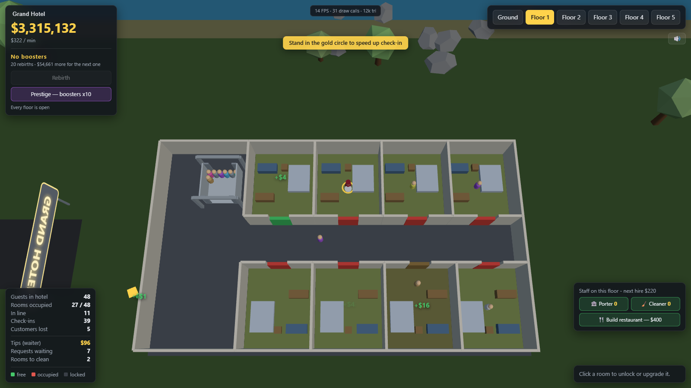

# Hotel Rush

*A top-down hotel where you are not the owner in a spreadsheet — you are the
waiter running the floors.*

A top-down 3D hotel management game that runs in the browser with Three.js.
No bundler, no build step — open it on a localhost and it works.

**Play it: https://lavazombie7404.github.io/3D-hotel-simulator/**



## Running it

```bash
npm install     # just three (+ playwright, optional, for the tests)
npm start       # http://localhost:8080
```

The server is `server.js`, a static server with zero dependencies (Node 18+).
You can pass another port: `node server.js 3000`.

## How it plays

You are **the waiter** — the little guy in the burgundy vest, with a tray and a
gold ring under his feet. The hotel runs without you, but it runs badly.

### The guests

1. They arrive on the road, walk into the lobby and queue at reception. If they
   see too long a line (more than 12 people), they turn around in the doorway
   and leave.
2. At check-in every guest pays you **$1**.
3. They then get **the best free room** — one guest per room.
4. If their room is upstairs, they wait for the lift, ride up and step out on
   the landing.
5. They stay for about 16 seconds, and at check-out they pay
   **$4 x the room level** (level 1 = $4, level 8 = $32), then take the lift
   back down and leave.
6. If no room is free they wait in the lobby for 25 seconds and then walk out —
   they show up under "Customers lost".

### The lift

It is a real lift, not a teleport: a cabin with sliding doors that travels
between floors. It takes hall calls and in-car floor buttons, and always heads
for the nearest requested stop. It has 14 seats to start with, and more as you
collect boosters. When the hotel is full a queue really does build up for it.

Ground floor rooms need no lift — you walk straight down the corridor.

### What you do

- **Room service.** While they are checked in, guests ring for the waiter: a
  gold diamond appears above the room. Walk in and you collect a tip of
  **$3 x the room level**. You have 14 seconds before the guest gives up.
- **Cleaning.** A room is dirty after check-out and cannot be let again.
  Housekeeping gets to it eventually; you clean it the moment you walk in, and
  get paid a little for it. A dulled floor and a small brown marker show which
  rooms are waiting.
- **Reception.** While you stand in the gold circle in front of the desk,
  check-in runs 2.5 times faster (1.1s → 0.44s per guest). When the hotel is
  busy the queue grows faster than reception can clear it on its own — that is
  the moment you need to be there.

So you run between the desk and the rooms: stand at reception while the line
builds up, then do a lap of the floors to collect the tips.

### Staff and the restaurant

You do not have to do all of it forever.

- **Porters** answer room service and **cleaners** turn rooms around. Each hire
  works a single floor and never leaves it, which keeps them out of the lift and
  makes hiring a decision you can reason about floor by floor. They walk at
  2.6 m/s against your 6.2, so buying staff frees you up without making you
  redundant — the front desk is still yours alone.
- **The restaurant** is a wing off the south side of the lobby. Once built,
  departing guests stop to eat before they leave and pay **$5 x its level** on
  top of the room. Upgrading adds two more tables, so a bigger dining room feeds
  more of the crowd at once.

### Money

You put it back into the hotel: unlock new rooms, raise their level and open up
floors. The more rooms you have unlocked, the more often guests turn up.

| Action | Cost |
|---|---|
| Unlock a room | $25 x 1.22^(rooms already unlocked) |
| Upgrade a room (level N → N+1) | $35 x 1.7^(N-1) |
| Open floor 1 / 2 / 3 / 4 / 5 | $450 / $1,800 / $6,000 / $20,000 / $60,000 |

A room's level shows in the colour of its floor and in the furniture that
appears as you go up: bed → nightstand → desk → sofa → TV → plant → rug.
Doors are **green** when the room is free, **red** when it is occupied and
**grey** when it is locked.

A higher level also means a bigger tip, not just a bigger room rate.

## Rebirth, new floors and prestige

Once you have earned enough in a run you can **rebirth**: you lose all your
progress (money, rooms, floors) and get **one permanent booster** in exchange.

- Each booster gives **+25% on all income** — check-in, room rate and tips.
- Boosters also speed up the **flow of guests**: more frequent arrivals and
  faster check-in at reception. Without that, floors earned late would sit
  empty, because the real limit would not be the room count but the desk.
- You start the next run with some extra cash, scaled by the root of your
  booster count.
- The goal rises: $5,000 for the first rebirth, then 50% more each time.

The building itself grows with you — **floors that did not exist before**:

| Rebirths | What appears |
|---|---|
| 10 | Floor 3 |
| 15 | Floor 4 |
| 20 | Floor 5 + **Prestige** unlocks |

At 20 rebirths **Prestige** shows up: it **multiplies the boosters you already
have by 10** and restarts the rebirth counter from zero. With 20 boosters
(+500% income) you jump straight to 200 (+5,000%). The floors you earned stay
open forever.

The full hotel has **6 levels and 48 rooms**.

The rebirth and prestige buttons take two clicks, so you cannot wipe everything
by accident; the confirmation expires by itself after a few seconds.

## Controls

| | |
|---|---|
| `W` `A` `S` `D` / arrows | move the waiter (relative to how the camera is turned) |
| `E` in the cabin | floor button: go up one level |
| `E` on the landing | call the lift to you |
| `1`...`6` in the cabin | press that floor's button |
| `1`...`6` outside the cabin | just move the view to another floor |
| `F` | camera follows the waiter (turns itself on at your first move) |
| Left click (drag) | rotate the camera |
| Right click (drag) | pan |
| Wheel | zoom |
| Click a room | select it (panel in the bottom right) |

You step into the cabin when it is stopped at your floor and ride along with
it. While the doors are shut you cannot get out.

There is no speed control: the simulation always runs in real time.

Your hotel's name is yours: click it at the top left and it changes on the sign
above the entrance too.

Only one floor is shown at a time — otherwise, seen from above, the floors on
top would cover everything. When you take the lift, the view follows you.

## How it is optimized

The whole scene draws in roughly 11-38 draw calls, no matter how many guests are
in the hotel (and there can be up to 300):

- **Every guest = 2 draw calls.** One `InstancedMesh` for the bodies and one
  for the heads, with pre-allocated capacity (300) and a per-instance colour.
- **The static architecture is merged.** The walls, slabs and woodwork of each
  floor are joined with `mergeGeometries` into a single geometry each, with
  `matrixAutoUpdate = false`.
- **Only the active floor is rendered.** The other five have `visible = false`,
  so they never even reach the pipeline.
- **Room floors, doors and furniture are instanced** and are rebuilt only when
  something actually changes (`roomsDirty` / `doorsDirty`), not every frame.
- **Zero allocations in the loop.** All the room and guest state lives in typed
  arrays (structure-of-arrays); the working `Object3D`, `Color` and `Vector3`
  objects are reused. In practice the garbage collector never fires during play.
- **Fixed simulation step** (1/60 s) with an accumulator, decoupled from the
  render rate — the game behaves identically at 60 or at 144 Hz, no matter how
  many frames the GPU manages to draw.
- **Lambert materials**, not Standard/PBR — much cheaper, and they look fine
  with hemisphere + directional lighting. Shadows are deliberately off.
- **The HUD is written at 5 Hz**, not every frame; the `+$` labels use a fixed
  pool of recycled DOM elements.
- **Raycasting on click only**, never per frame.
- **The landscape is three draw calls.** 150 trees, their trunks and the
  boulders are instanced, scattered from a fixed seed so the scenery is
  identical on every load.
- **Sound is synthesised, not loaded.** Every effect is oscillators and an
  envelope in `src/audio.js`, so audio costs zero bytes of download and makes no
  external request. Events only play on the floor you are watching.
- **The lift costs 2 draw calls**: the fixed parts of the cabin are merged into
  one mesh and the 4 door panels are an `InstancedMesh`.
- **The waiter's collisions reuse the very rectangles the walls are built from**
  in `build.js`, so the doorways come for free and there is no second collision
  model that could drift out of sync with the geometry. Movement is split into
  steps smaller than a wall is thick, so a long frame cannot throw him through
  one.

## Publishing on Poki

The build already meets Poki's technical bar:

- **Poki SDK** wired up (`src/poki.js`): `init`, `gameLoadingFinished`,
  `gameplayStart` on the player's first input, `gameplayStop` on any
  interruption, and a `commercialBreak` when gameplay resumes from a pause. No
  SDK event can fire during an ad. When the SDK is absent every call is a no-op,
  so the game runs anywhere.
- **Desktop, tablet and phone.** A virtual joystick drives the waiter on touch
  devices, the floor tabs double as the lift's floor buttons, and a contextual
  button calls or rides the lift.
- **The HUD survives 640x360**, Poki's smallest scale target.
- **Progress is saved** to localStorage, every call wrapped in try/catch so
  incognito cannot break it. If storage is unavailable the game says so.
- **Esc pauses and resumes.**
- **No debug tooling ships**: `window.__hotel` only exists on localhost or with
  `?debug`, and a test asserts it is gone on any other host.
- **Nothing is fetched from outside** except the Poki SDK itself.
- **788 KB of vendored three.js** (minified build), well inside the 8 MB budget.

What is left is not code: Poki is invite-only and hand-curated. You apply
through their game submission form, they review, and only then do you get
access to upload for a Web Fit Test. Poki also asks that you be able to explain
your tools and process, including AI use.

## Layout

```
index.html        HUD + styles
server.js         static server, no dependencies
src/config.js     every layout and balance constant
src/world.js      room state (typed arrays) + the economy
src/build.js      scene construction, merged geometry, instances
src/guests.js     the guest simulation + instanced rendering
src/player.js     the waiter: movement, collisions, room service
src/elevator.js   the lift cabin: calls, doors, seats, rendering
src/staff.js      hired porters and cleaners
src/audio.js      every sound effect, synthesised in code
src/sign.js       the hotel name, drawn to a canvas texture
src/tutorial.js   the first-run objectives
src/save.js       localStorage progress
src/poki.js       Poki SDK wrapper, no-op when the SDK is absent
src/touch.js      virtual joystick and the contextual lift button
src/ui.js         the HUD and the floating labels
src/main.js       renderer, top-down camera, input, game loop
vendor/           three.js + OrbitControls + BufferGeometryUtils (local)
tools/            automated Playwright tests
```

## Tests

```bash
npm start                      # in one terminal
node tools/smoke.mjs           # loads the game, lets it run, checks the console
node tools/upper-floors.mjs    # unlocks everything and checks the lift + floors
node tools/waiter.mjs          # movement, collisions, tips, the reception boost
node tools/elevator.mjs        # the cabin, the doors, passengers, and no gridlock
node tools/rebirth.mjs         # rebirth, the floors at 10/15/20, prestige
node tools/staff-restaurant.mjs # hired staff working alone, and the restaurant
node tools/poki-ready.mjs      # mobile, 640x360, saving, pause, no debug code
```

They all write screenshots to `tools/shots/`.

For tweaking from the browser console there is `window.__hotel`:
`__hotel.give(5000)`, `__hotel.unlockFloor(1)`, `__hotel.player`,
`__hotel.setSpeed(4)` (fast-forward only lives here now, for the tests),
`__hotel.lift`, `__hotel.stateCounts()` (how many guests are in each state),
`__hotel.unlockAll(3)`, `__hotel.grantRebirths(20)`, `__hotel.rebirth()`,
`__hotel.prestige()`.
