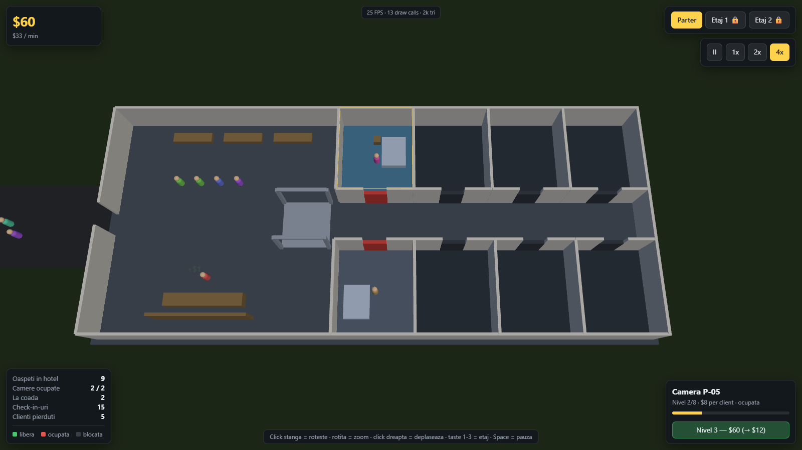

# 3D Hotel Simulator

Simulator 3D de hotel cu vedere **top-down**, rulat in browser cu Three.js.
Fara bundler, fara CDN — se deschide pe un localhost si merge.



## Cum il pornesti

```bash
npm install     # doar three (+ playwright, optional, pentru teste)
npm start       # http://localhost:8080
```

Serverul e `server.js`, un static server fara dependinte (Node 18+).
Poti da si alt port: `node server.js 3000`.

## Cum se joaca

1. Clientii vin pe drum, intra in lobby si se aseaza la coada la receptie.
2. La check-in fiecare client iti plateste **$1**.
3. Primeste apoi **cea mai buna camera libera** — un singur client per camera.
4. Urca cu liftul, sta cazat ~16 secunde, iar la check-out plateste
   **$4 x nivelul camerei** (nivel 1 = $4, nivel 8 = $32).
5. Daca nu e nicio camera libera, asteapta in lobby 25 de secunde si apoi
   pleaca — apare la "Clienti pierduti".

Banii ii bagi inapoi in hotel: deblochezi camere noi, le urci nivelul si
deschizi etajele 1 si 2. Cu cat sunt mai multe camere deblocate, cu atat vin
clientii mai des.

| Actiune | Cost |
|---|---|
| Deblocare camera | $25 x 1.26^(camere deja deblocate) |
| Upgrade camera (nivel N → N+1) | $35 x 1.7^(N-1) |
| Deschidere etaj 1 / etaj 2 | $450 / $1800 |

Nivelul camerei se vede din culoarea podelei si din mobilierul care apare pe
masura ce urci: pat → noptiera → birou → canapea → TV → planta → covor.
Usile sunt **verzi** cand camera e libera, **rosii** cand e ocupata si
**gri** cand e blocata.

## Comenzi

| | |
|---|---|
| Click stanga (drag) | roteste camera |
| Click dreapta (drag) | deplaseaza |
| Rotita | zoom |
| Click pe o camera | o selecteaza (panoul din dreapta-jos) |
| `1` `2` `3` | schimba etajul |
| `Space` | pauza |
| Butoanele `1x` `2x` `4x` | viteza simularii |

Se vede un singur etaj o data — altfel, la vedere de sus, etajele de deasupra
ar acoperi tot.

## Cum e facut optimizat

Scena intreaga se deseneaza in ~10-16 draw call-uri, indiferent de cati
oaspeti sunt in hotel:

- **Toti oaspetii = 2 draw call-uri.** Un `InstancedMesh` pentru corpuri si
  unul pentru capete, cu capacitate prealocata (180) si culoare per instanta.
- **Arhitectura statica e fuzionata.** Peretii, placile si lemnul fiecarui
  etaj sunt unite cu `mergeGeometries` in cate o singura geometrie, cu
  `matrixAutoUpdate = false`.
- **Se randeaza doar etajul activ.** Celelalte etaje au `visible = false`, deci
  nici nu ajung in pipeline.
- **Podelele, usile si mobilierul sunt instantiate** si se reconstruiesc doar
  cand chiar se schimba ceva (`roomsDirty` / `doorsDirty`), nu in fiecare cadru.
- **Zero alocari in bucla.** Toata starea camerelor si a oaspetilor sta in
  typed arrays (structure-of-arrays); `Object3D`, `Color` si `Vector3` de lucru
  sunt reutilizate. Deci practic nu se declanseaza garbage collector in joc.
- **Pas fix de simulare** (1/60 s) cu acumulator, decuplat de rata de randare —
  jocul se comporta identic la 60 sau la 144 Hz, iar `2x`/`4x` doar ruleaza mai
  multi pasi, nu schimba fizica.
- **Materiale Lambert**, nu Standard/PBR — mult mai ieftin, si arata bine cu
  lumina hemisferica + directionala. Umbrele sunt dezactivate intentionat.
- **HUD-ul se scrie la 5 Hz**, nu la fiecare cadru; textele `+$` folosesc un
  pool fix de elemente DOM reciclate.
- **Raycast doar la click**, niciodata per cadru.

## Structura

```
index.html        HUD + stiluri
server.js         static server fara dependinte
src/config.js     toate constantele de layout si de balans
src/world.js      starea camerelor (typed arrays) + economia
src/build.js      constructia scenei, geometrie fuzionata, instante
src/guests.js     simularea oaspetilor + randarea instantiata
src/ui.js         HUD-ul si textele flotante
src/main.js       renderer, camera top-down, input, bucla de joc
vendor/           three.js + OrbitControls + BufferGeometryUtils (local)
tools/            teste automate in Playwright
```

## Teste

```bash
npm start                      # intr-un terminal
node tools/smoke.mjs           # incarca jocul, lasa sa ruleze, verifica consola
node tools/upper-floors.mjs    # deblocheaza tot si verifica liftul + etajele
```

Ambele fac capturi de ecran in `tools/shots/`.

Pentru reglaje din consola browserului exista `window.__hotel`:
`__hotel.give(5000)`, `__hotel.unlockFloor(1)`, `__hotel.setSpeed(4)`.
